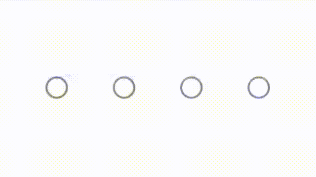
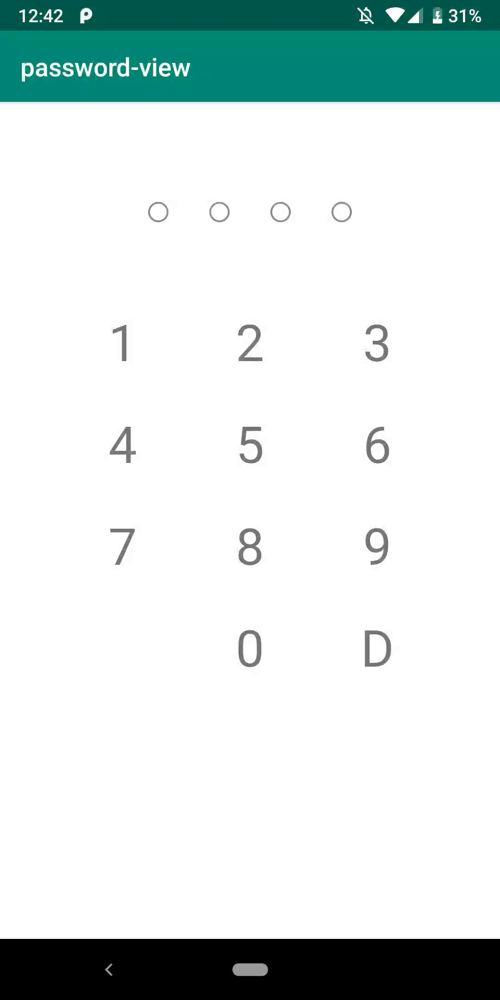

# password-view
Android password animation  
 
 
## Sample


## Useage

`implementation 'com.keijumt.passwordview:passwordview:1.0.0'`
### Layout.xml
```xml
<com.keijumt.passwordview.PasswordView
    android:id="@+id/passwordView"
    android:layout_width="wrap_content"
    android:layout_height="wrap_content"
    app:password_count="4" />
```

### Input and Remove password
```kotlin
// append the value of input and run input animation when text is input
passwordView.appendInputText(password)

// remove last characters from input values and run animation when text is removed
passwordView.removeInputText()
```

### Correct And Incorrect Animation

```kotlin
// Run animation when the password is correct
passwordView.correctAnimation()

// Run animation when the password is incorrect
passwordView.incorrectAnimation()
```

### Listener
```kotlin
passwordView.setListener(object : ActionListener {
    override fun onCompleteInput(inputText: String) {
        // When text input is completed
    }

    override fun onEndJudgeAnimation() {
        // When animation is completed when the password is correct or when it is incorrect
    }
})
```

### Attribute
`app:password_count` - The circle count 

`app:password_radius` - The circle radius

`app:password_between_margin` - The margin between circles

`app:password_input_color` - The color of the circle when the value is input

`app:password_not_input_color` - The color of the circle when the value is
not input

`app:password_outline_color` - The color of the line around the circle

`app:password_outline_stroke_width` - The stroke width of the line around
the circle

`app:password_correct_color` - The color of the circle when the password
is correct

`app:password_incorrect_color` - The color of the circle when the password
is incorrect

`app:password_correct_duration` - The animation time when the password is
correct

`app:password_incorrect_duration` - The animation time when the password
is incorrect

`app:password_color_change_duration` - The animation time when circle
color changes

`app:password_input_and_remove_duration` - The animation time when
password is input or remove

`app:password_correct_top` - In animation when the password is correct, the y coordinate of the highest circle

`app:password_correct_bottom` - In animation when the password is correct,
the y coordinate of the lowest circle

`app:password_incorrect_max_width` - In animation when the password is
incorrect, the swing width of the circle  


## License
```
Copyright 2019 Keiju Matsumoto

Licensed under the Apache License, Version 2.0 (the "License");
you may not use this file except in compliance with the License.
You may obtain a copy of the License at

   http://www.apache.org/licenses/LICENSE-2.0

Unless required by applicable law or agreed to in writing, software
distributed under the License is distributed on an "AS IS" BASIS,
WITHOUT WARRANTIES OR CONDITIONS OF ANY KIND, either express or implied.
See the License for the specific language governing permissions and
limitations under the License.
```